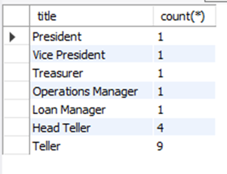

# Requirements

**Task 1**: Use the DESCRIBE statement to show the layout of the table employee.

**Task 2**: Select first name and last name of all employees (from employee table) with a “Teller” title.

**Task 3**: 
